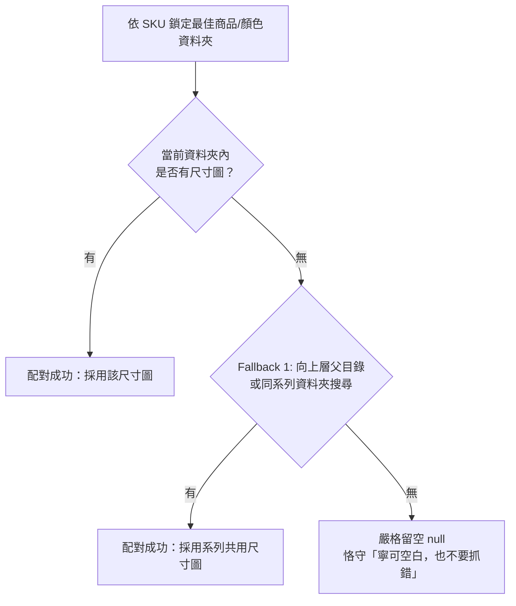

# 酷澎報價單與商品圖批量生成系統 - 產品技術細節與運作流程說明

> 本文件深入說明「酷澎 Excel 報價單生成系統 (v2.12.5)」之完整技術運作流程、多維度比對演算機制、圖檔自動命名規範，以及來源 Excel 必備欄位要求。

---

## 目錄
1. [系統核心運作流程 (End-to-End Pipeline)](#1-系統核心運作流程-end-to-end-pipeline)
2. [深度比對機制與積分制度剖析 (Matching Algorithms & Scoring Systems)](#2-深度比對機制與積分制度剖析-matching-algorithms--scoring-systems)
3. [目標檔案全欄位來源與回退機制清單 (Target Fields Mapping & Fallbacks)](#3-目標檔案全欄位來源與回退機制清單-target-fields-mapping--fallbacks)
4. [圖片與檔案自動命名規範 (Naming Conventions)](#4-圖片與檔案自動命名規範-naming-conventions)
5. [來源 Excel 必備與建議欄位規格 (Source Excel Specifications)](#5-來源-excel-必備與建議欄位規格-source-excel-specifications)
6. [常見異常處理與防呆機制 (Error Handling & Edge Cases)](#6-常見異常處理與防呆機制-error-handling--edge-cases)

---

## 1. 系統核心運作流程 (End-to-End Pipeline)

當使用者在前端介面上傳來源 Excel 檔案並點擊執行後，系統將依序執行以下 7 個處理階段：

```
[1. 上傳 Excel] ──► [2. 工作表與欄位智慧探測] ──► [3. 資料逐列過濾] ──► [4. 獨立欄位屬性直通]
                                                                                │
[7. 輸出資料夾 / ZIP] ◄── [6. 酷澎 Excel 生成寫入] ◄── [5. 本地圖片多維度評分匹配] ◄┘
```

### 階段一：Excel 檔案讀取與智慧欄位探測 (Upload & Field Mapping)
1. **工作表自動偵測 (`SharedUtils.getSourceSheet`)**：
   - 透過 `XlsxPopulate` 解析上傳的二進位檔案。
   - 優先搜尋預設設定的工作表（如 `Sheet1`、`商品資料`），若未找到則自動探測列數最多之有效工作表。
2. **表頭讀取與別名模糊比對 (`findBestHeaderSuggestion`)**：
   - 讀取「標題列（預設第 3 列）」的所有欄位名稱。
   - 透過內建同義詞字典進行二階段比對（完全相符優先 $\rightarrow$ 前綴/包含比對），自動推薦最佳來源欄位對應（例如：來源為「中文」自動對應至「商品名稱/中文品名」）。
3. **模板需求自動掃描與未匹配品項防呆提示 (`detectRequiredTemplates`)**：
   - 快速掃描整份工作表的品名與 Type 欄位，自動識別本份資料需要用到哪些報價單模板。
   - 若掃描發現有商品**未命中任何品類模板**，系統將主動彈出「未設定模板之商品品項提醒」視窗，依來源 Type 彙總統計出現次數（降冪排序）並支援展開手風琴檢視具體品項明細與列號，並提供「前往設定模板」按鈕直接跳轉至「對照表設定 ➔ 模板與設定檔」進行新增配置。

### 階段二：資料逐列讀取與前置過濾 (Filtering)
系統從設定的「資料起始列（預設第 4 列）」讀取至結尾，並進行前置過濾：
- **篩選欄位檢查**：預設檢查「`中文背標`」欄位，若該儲存格為空或無文字，代表該 SKU 毋需上架，直接略過。

### 階段三：獨立欄位屬性直通與萃取 (`CoupangProcessor.parseChineseName`)
系統全面移除易受廠商格式干擾的「品名空格位置切分」機制，商品各核心屬性 100% 直通來源獨立欄位，並支援在來源表設定進行全域配置：
- **屬性直通原則**：
   - **`品牌`**：優先讀取來源表設定之全域固定品牌（或 Profile 固定值），未填寫則留空。
   - **`製造廠商`**：優先讀取來源表設定之全域固定製造商（或 Profile 固定值）；若皆未填寫則自動採用品牌名稱。
   - **`系列`**：直通來源 Excel 的 `COLLECTION` / `系列` 欄位（亦支援 Profile 固定值）。
   - **`品類 (Type)`**：直通來源 Excel 設定之 `TYPE` / `品類` 欄位。
   - **`顏色`**：直通來源 Excel 設定之 `中文顏色` / `顏色` / `COLOR` 欄位。
   - **`尺寸`**：直通來源 Excel 設定之 `SIZE` / `尺寸` 欄位。
- **恪守「寧可空白，也不要抓錯」原則**：
   - 若來源 Excel 未提供獨立欄位且未設固定值，系統嚴格保持空白，杜絕因字串猜測導致錯誤數據寫入報價單。

### 階段四：模板與分類代碼自動判定 (`CoupangProcessor.getTargetTemplateAndCategory`)
- 系統將該列的 **中文品名** 與 **`Type` 欄位** 轉為大寫並合併為全文。
- 採用 **「長詞優先權重計分制 + 英文單詞邊界匹配」** 全面評估各模板 Profile（胸背帶、項圈牽繩、自訂品類等）設定之 `keywords`。
- **命中後自動取得**：
   1. 套用之目標 Excel 模板檔案（如 `商品報價單_胸背帶.xlsx`）。
   2. 酷澎官方細分商品種類與代碼（如 `寵物用品>狗用品>牽繩/胸背帶>胸背帶 (66030)`）。
   3. 產出之目標子資料夾名稱（如 `胸背帶/`）。
- **未命中處理**：若所有規則皆未命中，歸入 `UNMATCHED`（未分類品項），記錄於統計卡片並自動略過產檔，避免產生多餘空白模板。

### 階段五：本地照片多維度評分與自動配圖 (`CoupangProcessor.getLocalImagesForProduct`)
- 遍歷使用者選取的本機照片目錄（預期結構：`Photo/Collection/Type/中文顏色/` 或扁平目錄）。
- 執行多維度目錄評分（Type 權重 + Collection 權重 + Color 權重），鎖定最符合之商品圖檔資料夾。
- **圖檔自動尺寸規格化與補白邊 (1000×1000 正方形)**：
   - 商品正面主圖、情境圖 1、情境圖 2 均透過 HTML5 Canvas 高品質平滑縮放，並自動置中填補白底邊界為 **標準 1000×1000 像素**（正方形白底，符合酷澎高畫質上架規範）。
   - 尺寸規格表與背標圖亦自動確保解析度且短邊 $\ge 1000\text{px}$。
- **主圖、情境圖與背標圖獨立精準評分**：全面實施分數仲裁制，徹底杜絕同系列不同顏色誤抓。

### 階段六：酷澎標準報價單生成與格式化寫入 (`XlsxPopulate`)
- 載入對應模板，保留原始模板之所有公式、欄位寬度、凍結窗格與樣式。
- 逐列寫入商品資料，並進行防呆格式化：
   - **條碼 (EAN)**：強制轉為純文字格式（`@`），徹底防止 Excel 自動轉為科學記號（如 `8.05E+12`）。
   - **價格**：過濾幣別符號與千分位，轉為純數值。
   - **包裝尺寸**：自動將 `cm` 換算為整數 `mm`，統整為 `長*寬*高`（如 `120*80*25`）。
   - **包裝重量**：自動四捨五入為整數公克（g）。
   - **固定欄位自動補齊**：自動填入數量（`1個`）、稅別（`應稅(5%)`）、供貨方式（`官方代理商`）、進口標記、保存天數（`1095`）、審核聲明等。
   - **圖片檔名關聯**：將階段五處理完成的標準圖片檔名自動填入對應欄位。

### 階段七：分類存入資料夾或 ZIP 壓縮匯出
- 系統依品類自動建立子資料夾（如 `胸背帶/`、`項圈牽繩/`）。
- 資料夾內包含：產生的酷澎報價單 Excel、標準化處理後之商品主圖、情境圖、尺寸規格表、背標圖。
- 支援透過 File System Access API 一鍵存入本機目錄，或透過 JSZip 打包為 ZIP 壓縮檔案下載。

---

## 2. 深度比對機制與積分制度剖析 (Matching Algorithms & Scoring Systems)

系統在「報價單模板與品類判定」、「商品圖片目錄搜尋」、「主圖/情境圖挑選」以及「背標圖檔精確配對」各環節中，全面採用 **「統一邊界比對器 (`SharedUtils.matchToken`) + 階梯式量化評分仲裁制」**，徹底解決短詞被長詞誤包含（如「紅色」誤中「粉紅色」）之痛點。

---

### 2.1 通用邊界與長短詞防包含比對引擎 (`SharedUtils.matchToken`)

底層統一提供三層安全比對機制：
1. **ASCII 英文/數字單詞邊界防護**：透過 `(?:^|[^A-Z0-9])target(?:$|[^A-Z0-9])` 檢驗，防止 `S` 誤中 `XS`、`JACKET` 誤中 `JACKETS`、`RED` 誤中 `DARKRED`。
2. **中文符號與中英交界邊界防護**：支援底線 `_`、連字號 `-`、斜線 `/`、空格、括號、副檔名以及中英文自然交界（如 `BATHROBE黑`、`COLLAR甜杏`）。
3. **中文修飾前綴安全防護 (`strictNoPrefix`)**：當搜尋中文短詞（如 `紅色`、`牽繩`）時，若目標字串前方緊鄰修飾字元（`粉`、`暗`、`酒`、`深`、`淺`、`亮`、`桃`、`水`、`寶`、`草`、`青`、`嫩`、`土`、`鐵`、`米`、`墨`、`灰`、`紫`、`橘`、`橙`、`軍`、`鮮`、`雙`、`金`、`銀`、`微`、`超`、`抗`、`防`、`透`、`涼` 等），一律判定為不吻合，徹底杜絕「粉紅色 被誤判為 紅色」。

---

### 2.2 報價單模板與品類判定積分制度 (`getTargetTemplateAndCategory`)

系統將該列商品的 `[Type 欄位]` 與 `[中文品名]` 合併全文，逐一比對所有對照表 Profile 的關鍵字清單（`keywords`），計算匹配積分並由最高分者勝出：

| 評分項目 | 觸發條件 | 積分計算公式 | 說明 |
| :--- | :--- | :--- | :--- |
| **Type 欄位精確完全相符** | 來源 `Type` 欄位與模板關鍵字完全一致（不分大小寫） | **$1000 + \text{長度}\times 10$ 分** | 最高優先級，確保明確指定 Type 之商品 100% 命中對應模板。 |
| **Type 欄位單詞吻合** | 來源 `Type` 透過正則單詞邊界包含該關鍵字（如 `COOLING JACKET` 命中 `JACKET`） | **$500 + \text{長度}\times 10$ 分** | 支援英文複合 Type 詞彙邊界匹配，避免子字串誤判。 |
| **中文品名完全相符** | 商品 `中文品名` 與模板關鍵字完全一致 | **$800 + \text{長度}\times 10$ 分** | 次高優先級，品名完全精確命中特定模板。 |
| **中文品名 / 全文包含關鍵字** | `中文品名` 或全文中包含該關鍵字 | **$100 + \text{長度}\times 10$ 分** | 基礎語意包含分，**長詞權重階梯**確保長詞（如 `涼感大衣`）優先勝出短詞（如 `大衣`）。 |

- **勝出規則**：遍歷所有設定檔後取得最高分者；若所有模板積分皆為 0 分，則標記為 `UNMATCHED`（未分類品項），記錄於統計卡片並自動略過產檔。

---

### 2.3 圖片候選目錄多維度綜合評分制度 (`getLocalImagesForProduct`)

遍歷使用者選取的圖庫資料夾，對每個候選目錄路徑與目錄內檔案計算綜合匹配分數，鎖定最適商品圖目錄：

| 評分維度 | 具體加分項目與條件 | 增加積分 | 設計目的與防呆說明 |
| :--- | :--- | :---: | :--- |
| **1. 品類關鍵字匹配**<br>(Type Profile Matching) | 目錄路徑包含所屬模板 Profile 設定之關鍵字 | **+30 分** | 優先鎖定正確品類資料夾（如 `HARNESS`）。<br>**衝突排除**：若包含其他品類獨有關鍵字且非本品類，直接跳過該目錄。 |
| **2. 系列邊界匹配**<br>(Collection Matching) | 目錄路徑透過邊界比對**完全吻合**來源 `COLLECTION` | **+60 分** | 100% 直通來源系列欄位，邊界完全相符給予極高加分。 |
| | 目錄路徑子字串包含來源 `COLLECTION` | **+40 分** | 路徑包含系列名稱（非邊界獨立單詞）。 |
| | 目錄內有任一檔案檔名包含來源 `COLLECTION` | **+25 分** | 子目錄未命名系列但內部圖檔含有系列名稱之容錯加分。 |
| **3. 細分品類 Token 匹配**<br>(Sub-Type Matching) | 目錄路徑符合來源 `TYPE` 欄位拆解出的細分詞（如 `APRON`, `VEST`, `TOWEL`） | **+45 分** | 精確區分同系列下的不同款式子目錄（如訓練圍裙 vs 訓練背心）。 |
| **4. 顏色吻合加分**<br>(Color Matching) | 目錄路徑包含來源 `中文顏色` 欄位字串（含前綴防護） | **+40 分** | 優先鎖定指定中文顏色子目錄（如 `Photo/.../經典黑/`）。 |
| | 目錄內有圖檔檔名包含 `中文顏色`（含前綴防護） | **+30 分** | 目錄未標註中文顏色但圖檔標註中文顏色時之加分。 |
| | （備用）目錄路徑包含來源英文 `Color` 欄位字串 | **+35 分** | 來源無中文顏色時自動啟用英文顏色比對。 |
| **5. 尺寸精準邊界加分** | 目錄內有圖檔檔名符合該 SKU 之精確尺寸代碼邊界（`SharedUtils.matchToken`） | **+15 分** | 確保目錄內確實具備該規格之圖檔。 |
| **6. 品名核心關鍵詞加分** | 目錄內圖檔檔名包含品名通用拆解的核心詞（長度 $\ge 2$） | **每個詞 +15 分** | 多特徵詞累加加分，提高特殊款式目錄之比對權重。 |
| **7. 背標精準存在性加分** | 目錄內所含背標圖檔之最高匹配評分（`maxLblScore`） | **如實計入<br>(無上限封頂)** | **解除 120 分限制**：目錄內若含有專屬高分背標圖檔，該分數直接累計計入目錄總分，使具備對應背標之資料夾強勢勝出。 |

- **候選資格篩選**：
  1. 系列有效性判定：當來源有指定系列時，目錄必須命中系列（`collMatched`）或總分 $\ge 120$ 分，杜絕跨系列誤配。
  2. 排序取分：所有合格候選目錄依總分降冪排列，第一名（最高分者）即為該 SKU 之最終圖檔來源目錄。

---

### 2.4 主圖與情境圖候選評分仲裁機制 (`calculateMainImageScore` & `calculateSceneImageScore`)

為徹底解決扁平目錄下「先到先得」導致短詞顏色（如「紅色」）搶先抓走長詞顏色（如「粉紅色」主圖）之瑕疵，系統對目錄內所有圖檔實施**分數評選仲裁模型**：

| 圖檔類型 | 評分項目與條件 | 增加積分 |
| :--- | :--- | :---: |
| **商品正面主圖**<br>(Main Image) | 檔名包含 `主圖` / `main` / `主圖1` / `main_photo` | **+100 分**（非專屬檔名圖檔得 +30 分） |
| | 檔名精確命中商品 `中文顏色`（**嚴格前綴防護**，粉紅色不加給紅色） | **+50 分**（模糊包含得 +10 分） |
| | 檔名精確命中商品英文 `Color` 代碼 | **+40 分** |
| | 檔名包含商品 `SKU` / `EAN` 條碼代碼 | **+80 分** |
| | 檔名命中商品 `中文系列` / 品名關鍵詞 | **+20 / 每個詞 +15 分** |
| **情境圖 1 / 2**<br>(Scene Images) | 檔名明確包含 `情境圖 1` / `情境圖1` / `情境1` / `scene1` / `1.jpg` 等 | **+100 分** |
| | 檔名精確命中商品 `中文顏色` / `SKU` 條碼 | **+30 / +50 分** |

- **仲裁規則**：計算各圖檔之總得分，由**最高分者**勝出指派為主圖或情境圖，徹底杜絕顏色混淆。

---

### 2.5 商品實際中文背標圖評分制度 (`calculateBackLabelScore`)

背標匹配實施 **「尺寸硬邊界門檻 + 多維語意特徵加權」** 綜合評分制。**若圖檔未命中該 SKU 之指定尺寸，尺寸分直接歸 0，總分判定為 0 分（嚴格防護，不誤抓其他尺寸背標）**：

#### A. 基礎尺寸評分 (Base Size Score - 門檻項目，未通過則 0 分)
| 尺寸類型 | 比對條件與檔名命名特徵 | 基礎尺寸分 |
| :--- | :--- | :---: |
| **具體尺寸代碼**<br>(如 `M`, `L`, `35-1.0`, `110-1.2`) | **標準專屬命名直接命中**：檔名為 `^背標[_\-\s]?{尺寸}$`（如 `背標_M.jpg`、`背標_35-1.0.png`、`背標-S.jpg`） | **110 分** |
| | **正則尺寸邊界精確吻合**：`SharedUtils.matchToken` 邊界吻合（如 `_L_`、`[L]`、`-L-`、`L_背標`、`L.jpg`） | **100 分** |
| | **尺寸維度清洗比對**：去除 `CM`/`MM` 與符號後之長寬/厚度代碼完全包含於檔名中 | **90 分** |
| **單一尺寸**<br>(`UNISIZE`, `單一尺寸`, `ONE`) | 檔名包含 `單一尺寸`、`UNISIZE`、`_ONE`、` ONE` 或為 `背標_ONE` / `背標_單一尺寸` | **100 分** |
| | 檔名僅包含 `背標` 或 `LABEL` | **80 分** |
| **來源無尺寸商品**<br>(來源 Excel 未填尺寸欄位) | 檔名包含 `背標` 或 `LABEL`，且**未標註任何其他具體尺寸代碼**（無 S/M/L 或數字規格） | **90 分** |

#### B. 多維語意與特徵累加分 (Bonus Score - 通過基礎尺寸分後累加)
| 加分項目 | 觸發條件 | 增加積分 |
| :--- | :--- | :---: |
| **去底線中文品名完全比對** | 圖檔檔名去除底線（`_`）後，**完全包含該 SKU 之去除空白中文品名** | **+50 分** |
| **中文品名核心關鍵詞交集** | 圖檔檔名（直接/去底線/空格替換）包含品名拆解出之核心特徵詞（如「圍裙」、「附繩款」等） | **每個詞 +25 分** |
| **中文顏色精確吻合** | 圖檔檔名包含來源指定之 `中文顏色`（**前綴安全防護**） | **+30 分** |
| **系列名稱吻合** | 圖檔檔名包含來源 `中文系列` / `英文系列` | **+20 / +15 分** |

#### C. 雙階段搜尋與回退合格標準
1. **第一階段（主要目錄搜尋）**：在鎖定之商品目錄中搜尋，得分最高且 **總分 $\ge 90$ 分** 之圖檔直接採用。
2. **第二階段（單一明確回退 Fallback 1）**：若主要目錄無合格背標，跨目錄搜尋獨立 `背標/`、`LABEL/` 或 `BACK_LABEL/` 資料夾（若命中同系列額外 **+20 分**），得分最高且 **總分 $\ge 90$ 分** 者採用。
3. **第三階段（未命中嚴格留空）**：若仍無 $\ge 90$ 分之圖檔，**嚴格保持留空**（恪守「寧可空白，也不要抓錯」原則），並輸出黃色警告日誌。

---

### 2.6 尺寸規格表 (Size Chart) 配對與向上遞迴搜尋機制

尺寸規格表用於提供消費者挑選尺碼之參考依據，系統實施 **「關鍵字特徵識別 + 兩階段搜尋與單一回退 + 嚴格留空」** 機制：

#### A. 檔名關鍵字識別特徵
掃描圖檔時，系統檢驗圖檔檔名（不區分大小寫）是否包含下列關鍵字之一：
- 包含 `尺寸圖` 或 `尺寸表`
- 包含 `chart`（例如 `size chart_{品名}.png`、`size_chart.jpg`）
- 包含 `尺寸規格`

#### B. 兩階段搜尋與回退搜尋流程 (Search & Fallback Strategy)


1. **第一階段（主要目錄搜尋）**：
   - 優先在命中之商品 / 顏色子目錄（如 `Photo/胸背帶/PUFF/粉紅/`）搜尋符合關鍵字之圖檔。
2. **第二階段（單一明確回退 Fallback 1：向上層父目錄或同系列目錄搜尋）**：
   - 若該顏色目錄下無尺寸圖（多種顏色共用同一張尺寸表，通常置於上一層系列目錄如 `PUFF/`）：
   - 系統自動提取父目錄路徑（`parentPath`）或同系列目錄（`collZh` / `collEn`），向上遞迴搜尋符合尺寸表關鍵字之圖檔。
3. **第三階段（未命中嚴格留空）**：
   - 若兩階段皆未命中專屬尺寸圖，維持為 `null` 留空，恪守「寧可空白，也不要抓錯」原則，絕不以主圖或情境圖冒充。

#### C. 影像標準化處理與 Excel 寫入規範
1. **短邊合規化處理 (`ImageUtils.ensureMinShortEdge`)**：
   - 尺寸圖經 Canvas 處理，短邊自動縮放補正至 $\ge 1000\text{px}$，確保清晰度符合電商規格。
2. **匯出自動命名規範**：
   - 重新命名為 `尺寸規格表_{品名}.jpg`（如 `尺寸規格表_PUFF胸背帶_粉紅.jpg`）。
3. **Excel 對應欄位寫入**：
   - 自動將圖檔檔名寫入目標 Excel 之 `商品詳細說明圖集\n(消費者可見圖片）`（或相容欄位 `詳細說明圖集`、`尺寸圖`、`尺寸規格`）。
4. **同款式共用快取 (`styleImageCache`)**：
   - 同一款式（同系列/顏色）僅需處理一次尺寸圖，同款不同尺寸之各 SKU 共用快取成果，加速批次匯出效能。

---

## 3. 目標檔案全欄位來源與回退機制清單 (Target Fields Mapping & Fallbacks)

目標報價單中的每一個欄位，其**資料抓取來源優先級**與**自動回退機制 (Fallback)** 定義如下：

### 3.1 核心屬性與智慧解析欄位

| 目標欄位名稱 | 主要來源 (優先級 1) | 次要來源 (優先級 2) | 回退機制 (Fallback) | 格式處理與說明 |
| :--- | :--- | :--- | :--- | :--- |
| **`細分商品種類`** | 命中模板設定中指定之 **酷澎分類代碼與名稱** | 依品名或 Type 比對 profile 關鍵字動態歸類 | 若全部未命中，標記為 `UNMATCHED` 並略過 | 填入如 `寵物用品>狗用品>牽繩/胸背帶>胸背帶 (66030)`。 |
| **`商品名稱`** | 來源表動態對應所指定之品名欄位（預設：`中文品名`） | 留空 | 留空 | 保留完整品名，供酷澎前台展示。 |
| **`品牌`** | 來源表全域設定之 **全域固定品牌** | 模板 Profile 固定值 (相容) | 留空 | 優先順序：全域固定設定 $\rightarrow$ 模板固定設定 $\rightarrow$ 留空。 |
| **`製造廠商`** | 來源表全域設定之 **全域固定製造商** | 模板 Profile 固定值 (相容) | 自動採用商品品牌名稱 | 優先順序：全域固定設定 $\rightarrow$ 模板固定設定 $\rightarrow$ 自動採用品牌 $\rightarrow$ 留空。 |
| **`系列`** | 來源表設定之 **系列來源欄位**（預設：`COLLECTION`） | 模板 Profile 固定值 (相容) | 留空 | 100% 直通來源獨立欄位或 Profile 固定值。 |
| **`品類 (Type)`** | 來源表全域設定之 **品類來源欄位**（預設：`TYPE`） | 別名探測候選欄位 | 留空 | 用於模板與分類代碼判定及圖檔品類目錄比對。 |
| **`顏色`** | 來源表全域設定之 **顏色來源欄位**（預設：`中文顏色`） | 別名探測候選欄位 | 留空 | 100% 直通來源獨立欄位，不依賴品名字串拆分。 |
| **`尺寸`** | 來源表全域設定之 **尺寸來源欄位**（預設：`SIZE`） | 別名探測候選欄位 | 留空 | 100% 直通來源獨立欄位，未填寫則留空。 |

---

### 3.2 來源數值與規格動態對應欄位 (Dynamic Mappings)

| 目標欄位名稱 | 預設來源欄位 | 欄位別名探測支援 | 格式化轉換與防呆機制 |
| :--- | :--- | :--- | :--- |
| **`商品條碼`** | `EAN` | `條碼`、`商品條碼`、`國際條碼`、`SKU`、`Barcode`、`EanCode` | 強制去除 `.0`，並以文字格式（`@`）寫入，徹底防止科學記號（如 `8.05E+12`）。 |
| **`酷澎進價 (含稅)`** | `酷澎進價` | `進價`、`進價(含稅)`、`採購價`、`Cost` | 過濾幣別符號（`NT$`、`$`）與千分位逗號，轉換為純數值。若無法解析為有效正數則回傳空字串（防 NaN）。 |
| **`建議酷澎售價`** | `台灣訂價` | `建議售價`、`售價`、`定價`、`訂價`、`Price` | 過濾幣別符號與千分位逗號，轉換為純數值。 |
| **`每單位包裝尺寸(mm)`** | `每單位包裝尺寸(mm)` | `包裝尺寸`、`尺寸(mm)`、`包裝尺寸(cm)` | 1. 統一將符號 `x`、`×` 取代為 `*`。<br>2. 偵測若含 `cm` 則自動乘以 10 換算為整數 `mm`。<br>3. 標準輸出格式為 `長*寬*高`（如 `120*80*25`）。無法解析則留空。 |
| **`每單位包裝重量(g)`** | `每單位包裝重量(g)` | `包裝重量`、`重量(g)`、`重量`、`Weight` | kg 自動乘 1000，自動四捨五入為整數公克（g）。若無法解析則留空。 |

---

### 3.3 全域與模板固定填寫常數欄位 (Fixed Mappings & Precedence)

系統將通用常數移至「**來源表設定 ➔ 全域固定欄位**」統一管理，同時支援個別品類模板在「**對照表設定 ➔ 固定欄位**」進行覆寫設定。**若全域設定與模板設定衝突，一律以模板設定為主**。

#### A. 全域固定欄位 (Global Fixed Mappings)
| 目標欄位名稱 | 預設固定值 | 說明 |
| :--- | :--- | :--- |
| **`包裝上方 (內部上架審核用)`** | `嚴正聲明-本商品無外包裝照片` | 內部審核免包裝照宣告。 |
| **`包裝下方 (內部上架審核用)`** | `嚴正聲明-本商品無外包裝照片` | 內部審核免包裝照宣告。 |
| **`包裝左側 (內部上架審核用)`** | `嚴正聲明-本商品無外包裝照片` | 內部審核免包裝照宣告。 |
| **`包裝右側 (內部上架審核用)`** | `嚴正聲明-本商品無外包裝照片` | 內部審核免包裝照宣告。 |
| **`是否應稅`** | `應稅(5%)` | 稅別標記。 |
| **`供貨方式`** | `官方代理商` | 供貨商身份。 |
| **`是否為進口商品`** | `進口商品` | 進口標記。 |
| **`法定種類`** | `TW_General` | 法定種類填寫項。 |
| **`國內製造商或負責商名稱`** | `緯豪實業有限公司` | 代理商公司名稱。 |

#### B. 模板專屬固定欄位 (Profile Fixed Mappings)
| 目標欄位名稱 | 預設固定值 | 說明 |
| :--- | :--- | :--- |
| **`數量`** | `1個` | 銷售單位。 |
| **`單箱商品入數`** | `1` | 箱入數。 |
| **`商品保存天數`** | `1095` | 保存天數（3 年）。 |
| **`是否為易碎品`** | `不適用` | 易碎標記。 |
| **`原產地/國`** | `中國` | 商品產地。 |
| **`注意事項/備註欄`** | `請參考產品實際包裝所示` | 上架備註。 |

---

### 3.4 圖片與背標關聯欄位 (Image Mappings)

| 目標欄位名稱 | 關聯圖檔來源 | 檔名生成規則 | 回退機制 (Fallback) |
| :--- | :--- | :--- | :--- |
| **`商品正面(主要圖片）`** | 多維度評分鎖定之顏色目錄正面圖 | `{去除尺寸之中文品名}主圖.jpg` | 同品名同顏色之多尺寸 SKU 自動共用。若未找到圖片則留空並於日誌標註缺圖。 |
| **`商品側拍或情境圖 1\n(消費者可見圖片）`** | 該目錄下之情境圖 1 | `1.jpg` | 縮放補白邊為 1000×1000。若無則留空。 |
| **`商品側拍或情境圖 2\n(消費者可見圖片）`** | 該目錄下之情境圖 2 | `2.jpg` | 縮放補白邊為 1000×1000。若無則留空。 |
| **`商品詳細說明圖集\n(消費者可見圖片）`**<br>(或 `尺寸圖` / `尺寸規格`) | 顏色目錄或系列目錄之尺寸規格圖 | `尺寸規格表_{去除尺寸之中文品名}.jpg` | **自動向上遞迴**：若顏色目錄無尺寸圖，自動往上層系列目錄搜尋共用尺寸圖；若無則留空。 |
| **`商品實際中文背標圖\n(內部上架審核用)`** | 背標目錄或相簿中精確匹配之背標檔 | `背標_{完整中文品名}_{尺寸}.jpg` | **語意與尺寸多維度精準計分**：結合尺寸硬邊界（杜絕串碼）、中文品名核心詞交集加權與顏色完全吻合，精準鎖定子款式背標；無對應尺寸時標記缺圖並留空，不誤抓其他尺寸。 |

---

## 4. 圖片與檔案自動命名規範 (Naming Conventions)

### 4.1 匯出圖片與報價單命名規範
為符合酷澎上架規範與批次管理需求，系統在匯出時會自動將所有圖檔重新命名為標準格式：

| 圖片類型 | 匯出命名格式範例 | 說明 |
| :--- | :--- | :--- |
| **商品正面主圖** | `{去除尺寸之中文品名}主圖.jpg`<br>例：`聖特羅佩系列 雙層皮革X型犬用胸背帶 經典黑主圖.jpg` | 同品名同顏色之多尺寸 SKU 自動共用同一張主圖。自動等比縮放並補白邊為 1000×1000 標準正方形。 |
| **情境圖 1** | `{編號}.jpg`<br>例：`1.jpg` | 消費者可見之側拍/情境圖，自動補白邊為 1000×1000 標準正方形，保留簡潔編號。 |
| **情境圖 2** | `{編號}.jpg`<br>例：`2.jpg` | 消費者可見之側拍/情境圖，自動補白邊為 1000×1000 標準正方形。 |
| **尺寸規格表** | `尺寸規格表_{去除尺寸之中文品名}.jpg`<br>例：`尺寸規格表_聖特羅佩系列 雙層皮革X型犬用胸背帶 經典黑.jpg` | 詳細說明圖集用，確保高解析度短邊 $\ge 1000\text{px}$，支援同系列向上遞迴共用。 |
| **商品背標圖** | `背標_{完整中文品名}_{尺寸}.jpg`<br>例：`背標_聖特羅佩系列 雙層皮革X型犬用胸背帶 經典黑 35-1.0_35-1.0.jpg` | 精確依 SKU 尺寸綁定對應背標圖。 |
| **報價單 Excel** | `{模板原檔名}_auto_generate.xlsx`<br>例：`商品報價單_胸背帶_auto_generate.xlsx` | 依品類分別輸出於各自子資料夾。 |

---

### 4.2 圖庫來源資料夾命名最佳實踐規範 (Recommended Photo Naming for Image Team)

為建立圖片組良好且統一的命名習慣，提高資料夾的可讀性與跨品牌通用維護性，**強烈建議在英文品名/Type 與「中文顏色」之間保留標準空格**：

- **推薦標準命名格式**：`{COLLECTION} {TYPE} {中文顏色}`
  - ✅ **標準推薦**：`PUFF HARNESS 深藍`、`BLISS LEASH 紅`、`BLISS LEASH 粉紅`、`AALTO PET BATHROBE 黑`
  - ℹ️ **相容性說明**：底層比對引擎支援中英交界邊界識別，亦相容未帶空格之命名（如 `BLISS LEASH紅`），但圖片組規範化命名建議全面維持空格。
- **子目錄結構格式（亦支援）**：`Photo/{COLLECTION}/{TYPE}/{中文顏色}/`
  - ✅ `Photo/PUFF/HARNESS/深藍/`
- **資料夾內部圖檔建議規範**：
  - `主圖.jpg`（商品正面主要圖片）
  - `情境圖1.jpg`、`情境圖2.jpg`（商品情境側拍照）
  - `size chart_{品名}.png` 或 `尺寸圖.jpg`（尺寸規格表）
  - `背標_{尺寸}.jpg` 或包含完整商品中文名稱與尺寸之背標圖檔（如 `芬蘭_Rukka_PUFF_狗胸背帶_深藍_M_深藍_M.png`）

---

## 5. 來源 Excel 必備與建議欄位規格 (Source Excel Specifications)

為使系統能全自動且無誤地完成解析、分類與填表，來源 Excel 應符合以下欄位規範：

### 5.1 必填核心欄位（缺少將無法正常產出）

| 欄位名稱 (常用別名) | 資料格式範例 | 系統用途說明 | 重要注意事項 |
| :--- | :--- | :--- | :--- |
| **`中文品名`**<br>(商品名稱 / 品名 / 中文) | `品牌名 隱士系列 頂級皮革狗項圈 經典黑 L` | 作為報價單「商品名稱」完整寫入，並用於輔助品類與圖檔特徵詞比對。 | 不再依賴特定空格位置拆解屬性。 |
| **`中文背標`**<br>(或指定之篩選欄位) | `有` / `背標文字` | 判斷該筆 SKU 是否需產生報價單（非空才處理）。 | 未填寫或留空之列會被自動略過。 |
| **`EAN`**<br>(條碼 / 商品條碼 / 國際條碼) | `8051234567890` | 酷澎商品條碼。 | 系統會強制去除 `.0` 並轉為文字格式，防止科學記號變形。 |
| **`酷澎進價`**<br>(進價 / 採購價) | `1200` 或 `850.5` | 酷澎進貨採購成本（含稅）。 | 請填寫純數字，勿帶幣別符號（如 `NT$`）。 |
| **`台灣訂價`**<br>(建議售價 / 市價) | `2400` | 建議酷澎售價。 | 請填寫純數字。 |

### 5.2 建議獨立屬性欄位（強烈建議提供，實現 100% 直通填寫與精準配圖）

| 欄位名稱 | 資料格式範例 | 系統用途說明 |
| :--- | :--- | :--- |
| **`COLLECTION`** (系列 / 英文系列) | `HERMITAGE`, `AMALFI`, `MONZA` | 直通填入「系列」欄位，並直接比對照片目錄樹之英文系列資料夾。 |
| **`TYPE`** (品類 / 種類) | `HARNESS`, `COLLAR`, `LEASH` | 高優先級決定套用之 Excel 模板與照片目錄品類過濾。 |
| **`中文顏色`** (或 `COLOR` / `顏色`) | `經典黑`, `土耳其藍` (或 `BLACK`) | 直通填入「顏色」欄位，並直接比對照片目錄樹之顏色資料夾。 |
| **`SIZE`** (尺寸 / 規格) | `L`, `M`, `35-1.0`, `110-1.2` | 直通填入「尺寸」欄位，並用於背標圖精確尺寸配對。 |
| **`BRAND`** (品牌 / 廠牌) | `RUKKA`, `PAW` | 直通填入「品牌」與「製造廠商」欄位。 |
| **`每單位包裝尺寸(mm)`** | `120*80*25` 或 `12*8*2.5cm` | 自動換算為標準 `長*寬*高` (mm) 填入報價單。 |
| **`每單位包裝重量(g)`** | `150` | 自動四捨五入為整數公克 (g) 填入報價單。 |

---

## 6. 常見異常處理與防呆機制 (Error Handling & Edge Cases)

1. **未命中任何品類規則 (Unmatched SKU)**：
   - 若品名與 Type 皆無法命中任何模板，系統會即時輸出警告日誌並於診斷區「未配對報價單 (略過)」卡片中計數，自動略過該商品不寫入任何報價單與圖檔輸出，避免產生未定義之空白檔案。
2. **圖檔自動規格化至 1000×1000 正方形白底**：
   - 酷澎官方規範建議主圖與情境圖為 $1000\times 1000$ 正方形。系統在輸出前會全自動將主圖、情境圖以 Canvas 高品質等比縮放並置中填補白底邊界至 $1000\times 1000$，確保完全符合上架規格且絕不變形。
3. **長度與重量單位自動換算與防呆**：
   - 若包裝尺寸欄位填寫為 `12*8*2.5cm`，系統自動辨識 `cm` 單位並乘以 10，轉換為標準之 `120*80*25` (mm)；若數值無效或格式不符則留空，徹底杜絕 `NaN` 寫入。
4. **必填欄位缺空自動標註紅色底色 (Missing Required Fields Red Highlight)**：
   - 系統在最終產出與壓縮各報價單前，會自動依據模板第 6 列掃描所有「必填」欄位（如商品名稱、商品條碼、主要圖片、側拍情境圖、尺寸圖、背標圖、進價、售價等）。
   - 若任一資料列之必填儲存格值為空（未配對到圖檔、未填寫條碼或缺少規格），系統自動將該儲存格底色填為紅色（`ffff0000`），方便上架與審核人員於 Excel 中一眼辨識缺漏資訊並及時補正。
